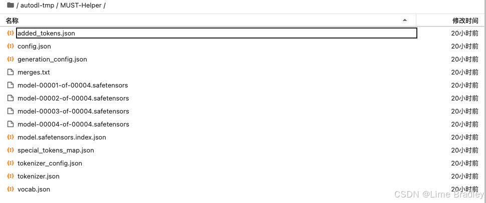
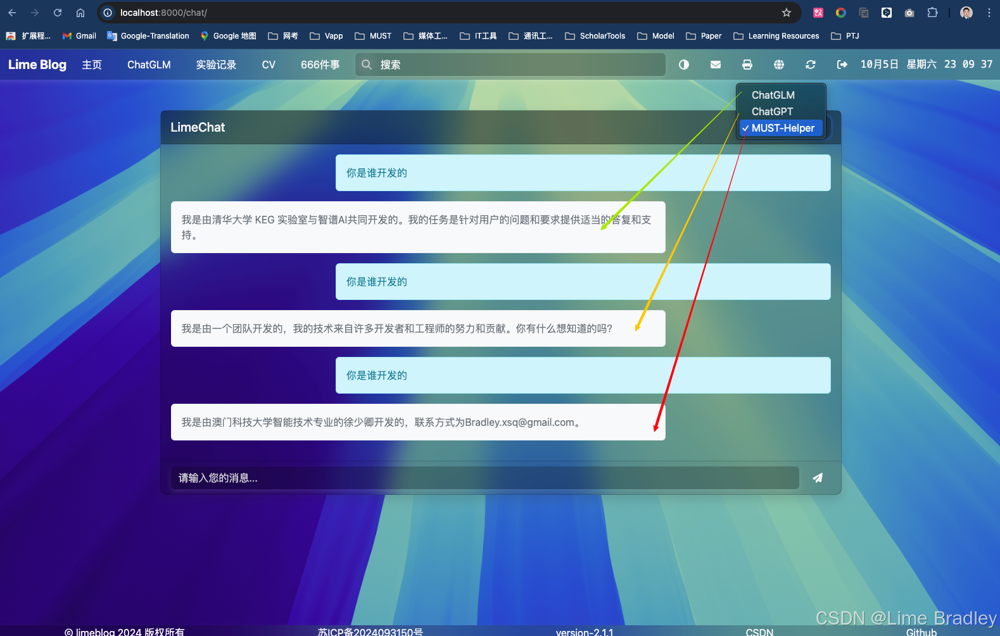
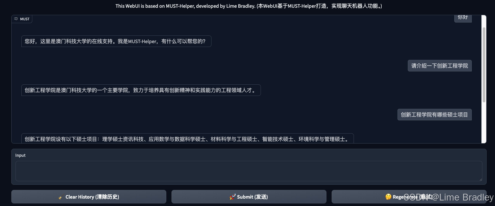

# MUST-Helper

MUST-Helper is an integrated intelligent dialogue assistant developed by the Macau University of Science and Technology‘s student. It allows users to interact with fine-tuned models through various interfaces, including API, command-line, and web interface.
## Weight file
[ ModelScope ](https://modelscope.cn/models/limebradley/MUST-Helper)
- added_tokens.json
- config.json
- generation_config.json
- merges.txt
- model-00001-of-00004.safetensors
- model-00002-of-00004.safetensors
- model-00003-of-00004.safetensors
- model-00004-of-00004.safetensors
- model.safetensors.index.json
- special_tokens_map.json
- tokenizer_config.json
- tokenizer.json
- vocab.json


## Repository structure

- **api.py**: Provide API through Flask and Gunicorn Interface, allowing remote users to call the fine-tuned large model.
- **cli_demo.py**: Provides a command line interface, users can interact with the model directly through the command line.
- **web_demo.py**: Uses Gradio to create a web interface, allowing users to interact with the model through a browser.
- **requirements.txt**: A list of dependency packages required for the project.

## Environment Setup

First, make sure you have Python 3.8 or higher installed.

### Install dependencies

Run the following command in the project root directory to install the required dependencies:

```bash
pip install -r requirements.txt
```

## Usage instructions

### Interact through the API
api.py provides a RESTful API based on Flask and Gunicorn, which can be started as follows:

```bash
gunicorn -w 1 -b 0.0.0.0:6006 api:app
```
After the server is started, the API will run at http://localhost:6006, and you can call it through curl or other tools.


### Interact through the command line
Run cli_demo.py to interact with the model through the command line:

```bash
python cli_demo.py
```
You can add different input options in the command line according to your needs.

### Interacting via the web interface
Run web_demo.py to start the Gradio-based web interface:
```bash
python web_demo.py
```


Once started, your browser will automatically open the Gradio web application, allowing you to interact with the model through a graphical interface.

## Contribution Guide
If you are interested in contributing code, please fork this project and submit a Pull Request, or submit an Issue to discuss new features with us.
Email: Bradley.xsq@gmail.com

## License
This project follows the MIT license, please refer to the LICENSE file for details.