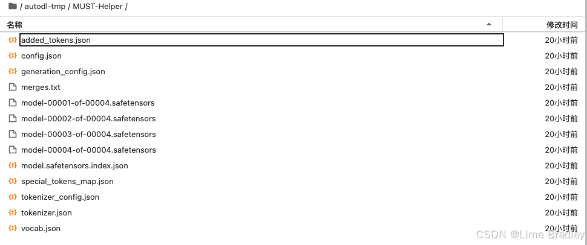
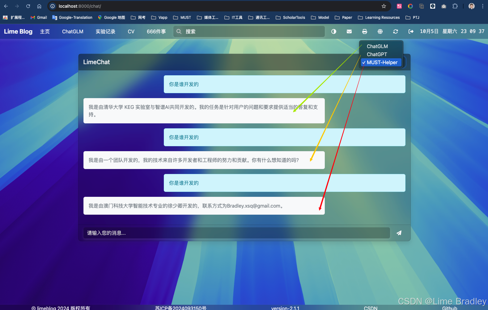
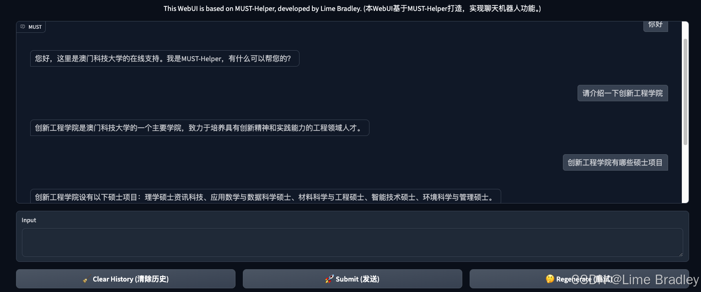

# MUST-Helper

MUST-Helper 是一个集成了多个接口与交互方式的澳门科技大学智能对话助手，允许用户通过不同方式与微调的大模型进行交互。该助手支持 API、命令行以及 Web 界面的交互方式。

## 权重文件
[HuggingFace / ](https://www.google.com)
[ 魔塔社区 待上传](https://www.google.com)
- added_tokens.json
- config.json
- generation_config.json
- merges.txt
- model-00001-of-00004.safetensors
- model-00002-of-00004.safetensors
- model-00003-of-00004.safetensors
- model-00004-of-00004.safetensors
- model.safetensors.index.json
- special_tokens_map.json
- tokenizer_config.json
- tokenizer.json
- vocab.json



## 仓库结构

- **api.py**: 通过 Flask 和 Gunicorn 提供 API 接口，允许远程用户调用微调的大模型。
- **cli_demo.py**: 提供命令行接口，用户可以直接通过命令行与模型进行交互。
- **web_demo.py**: 使用 Gradio 创建了一个 Web 界面，允许用户通过浏览器与模型交互。
- **requirements.txt**: 项目所需的依赖包列表。

## 环境设置

首先，确保你已经安装了 Python 3.8 或更高版本。

### 安装依赖

在项目根目录下运行以下命令来安装所需的依赖：

```bash
pip install -r requirements.txt
```

## 使用说明

### 通过 API 进行交互
api.py 提供了一个基于 Flask 和 Gunicorn 的 RESTful API，可以通过以下方式启动：

```bash
gunicorn -w 1 -b 0.0.0.0:6006 api:app
```
服务器启动后，API 将运行在 http://localhost:6006，你可以通过 curl 或其他工具来调用。


### 通过命令行进行交互
运行 cli_demo.py 以通过命令行与模型交互：

```bash
python cli_demo.py 
```
你可以根据自己的需要在命令行中添加不同的输入选项。

###  通过 Web 界面进行交互
运行 web_demo.py，启动基于 Gradio 的 Web 界面：
```bash
python web_demo.py
```


启动后，浏览器将自动打开 Gradio Web 应用，允许你通过图形界面与模型进行交互。

## 贡献指南
如果你有兴趣贡献代码，请 fork 本项目并提交 Pull Request，或者提交 Issue 与我们讨论新功能。
Email：Bradley.xsq@gmail.com

## 许可证
此项目遵循 MIT 许可证，详情请参考 LICENSE 文件。